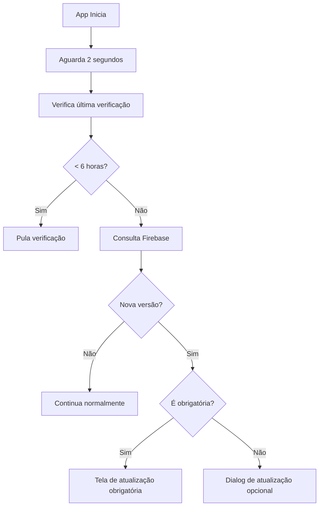

# 🔄 Sistema de Atualizações Automáticas - CORTE REAL

## 🎯 **Visão Geral**

O sistema de atualizações permite que o app seja atualizado sem precisar reinstalar, oferecendo uma experiência contínua para os usuários.

### ✅ **Funcionalidades Implementadas:**

- 🔍 **Verificação automática** de atualizações no startup
- 📱 **Interface amigável** para notificar sobre updates
- ⚠️ **Atualizações obrigatórias** para correções críticas
- 🔄 **Atualizações opcionais** que o usuário pode pular
- 📋 **Histórico de versões** com notas de lançamento
- 🕒 **Controle de frequência** de verificações (6 horas)

---

## 🚀 **Como Funciona**

### **1. 📊 Estrutura no Firebase**

O sistema usa o Firestore para gerenciar informações de versão:

```
firestore/
├── app_config/
│   └── version_info (documento principal)
│       ├── version: "1.1.0"
│       ├── buildNumber: 2
│       ├── downloadUrl: "https://exemplo.com/app-v1.1.0.apk"
│       ├── releaseNotes: "Correção de bugs e melhorias..."
│       ├── releaseDate: "2025-09-21T10:30:00Z"
│       ├── isForceUpdate: false
│       └── minRequiredVersion: "1.0.0"
└── version_history/
    └── versions/ (subcoleção com histórico)
```

### **2. 🔄 Fluxo de Verificação**



---

## 👨‍💼 **Para Administradores**

### **🔧 Como Publicar uma Nova Versão**

#### **1. Preparar o APK**
```powershell
# 1. Atualizar versão no pubspec.yaml
version: 1.1.0+2  # versão.build

# 2. Compilar APK de produção
flutter build apk --release

# 3. APK estará em: build/app/outputs/flutter-apk/app-release.apk
```

#### **2. Hospedar o APK**
- **Opção A**: Google Drive (público)
- **Opção B**: Firebase Storage
- **Opção C**: Servidor próprio
- **Opção D**: GitHub Releases

#### **3. Atualizar Informações no Firebase**

```dart
// Exemplo de código para atualizar (pode ser via console admin)
await UpdateService.createVersionInfo(
  version: '1.1.0',
  buildNumber: 2,
  downloadUrl: 'https://drive.google.com/uc?id=SEU_FILE_ID',
  releaseNotes: '''
  🎉 Novidades da versão 1.1.0:
  
  ✅ Sistema de aniversários implementado
  ✅ Interface aprimorada
  ✅ Correção de bugs menores
  ✅ Melhor performance
  
  📱 Atualize agora para aproveitar todas as novidades!
  ''',
  isForceUpdate: false, // true para obrigatória
  minRequiredVersion: '1.0.0',
);
```

---

## 📱 **Para Desenvolvedores**

### **🔧 Configuração Inicial**

#### **1. Dependências (já adicionadas)**
```yaml
dependencies:
  url_launcher: ^6.3.1
  package_info_plus: ^8.0.2
  shared_preferences: ^2.2.2
  cloud_firestore: ^5.4.4
```

#### **2. Estrutura de Arquivos**
```
lib/
├── models/
│   └── app_version.dart          # Modelo de dados
├── services/
│   └── update_service.dart       # Lógica de atualizações
├── screens/
│   └── update_screen.dart        # Interface de atualização
└── widgets/
    └── app_startup_wrapper.dart  # Verificação no startup
```

### **🛠️ Personalizações Disponíveis**

#### **Frequência de Verificação**
```dart
// Em update_service.dart
static const Duration _checkInterval = Duration(hours: 6); // Alterar aqui
```

#### **Comportamento no Debug**
```dart
// Para testar em desenvolvimento
if (kDebugMode) {
  debugPrint('UpdateService: Pulando verificação em modo debug');
  return null; // Desabilitar esta linha para testar
}
```

---

## 🎯 **Cenários de Uso**

### **📋 Atualização Opcional**
- **Quando usar**: Melhorias, novas funcionalidades
- **Comportamento**: Dialog informativo, usuário pode pular
- **Configuração**: `isForceUpdate: false`

### **⚠️ Atualização Obrigatória**
- **Quando usar**: Correções críticas, mudanças de API
- **Comportamento**: Tela full-screen, não permite pular
- **Configuração**: `isForceUpdate: true`

### **🔄 Atualizações Graduais**
```dart
// Para liberar gradualmente:
minRequiredVersion: '1.0.5' // Usuários abaixo desta versão são obrigados
```

---

## 📊 **Monitoramento e Analytics**

### **📈 Métricas Importantes**
- Taxa de adoção de atualizações
- Tempo entre lançamento e instalação
- Versões em uso no campo
- Problemas de download

### **🔧 Debug e Logs**
```dart
// Logs automáticos incluem:
debugPrint('UpdateService: Nova versão disponível: ${version}');
debugPrint('UpdateService: App está atualizado');
debugPrint('UpdateService: Erro ao verificar atualizações');
```

---

## 🎛️ **Console de Administração**

### **📋 Tela de Configurações Admin**

Pode ser adicionada uma seção no AdminDashboard:

```dart
// Funcionalidades úteis:
- Ver versão atual instalada
- Forçar verificação de atualização
- Ver histórico de versões
- Estatísticas de adoção
- Gerenciar atualizações obrigatórias
```

---

## 🚨 **Troubleshooting**

### **🔧 Problemas Comuns**

#### **"Não encontra atualização"**
```dart
// Soluções:
1. Verificar se documento existe no Firestore
2. Limpar cache: UpdateService.clearUpdateCache()
3. Verificar conectividade
```

#### **"Download falha"**
```dart
// Soluções:
1. Verificar URL do APK
2. Verificar permissões de download
3. Testar URL no navegador
```

#### **"Versão não reconhece"**
```dart
// Soluções:
1. Verificar formato de versão (x.y.z)
2. Comparar buildNumber
3. Verificar pubspec.yaml
```

---

## 🎉 **Benefícios do Sistema**

### **✅ Para Usuários**
- 📱 App sempre atualizado
- 🔄 Sem necessidade de reinstalar
- 📋 Transparência sobre novidades
- ⚡ Download automático

### **✅ Para Desenvolvedores**
- 🚀 Deploy rápido de correções
- 📊 Controle sobre adoção
- 🛠️ Flexibilidade de estratégias
- 📈 Métricas de uso

### **✅ Para o Negócio**
- 💰 Menos abandono por versão antiga
- 🎯 Funcionalidades chegam mais rápido
- 🔧 Correções imediatas
- 📱 Experiência consistente

---

## 🔮 **Próximas Melhorias**

### **🛠️ Funcionalidades Futuras**
- 🔄 **Download em background** com progress
- 📊 **Dashboard de versões** completo
- 🎯 **Segmentação** por tipo de usuário
- 📱 **Rollback automático** em caso de problemas
- 🔔 **Notificações push** para atualizações
- 📈 **A/B testing** para releases

---

## 💡 **Exemplo Prático de Uso**

### **🎯 Cenário: Nova funcionalidade de agendamento**

```bash
# 1. Desenvolvedor termina feature
# 2. Atualiza version no pubspec: 1.2.0+3
# 3. Compila APK release
# 4. Upload para Google Drive/servidor
# 5. Atualiza Firebase com novo link
# 6. Usuários recebem notificação automática
# 7. Download e instalação suave
# 8. Nova funcionalidade disponível!
```

**🚀 Resultado**: Zero fricção para o usuário, máxima velocidade de deploy!

---

**💫 O sistema está 100% implementado e pronto para uso em produção!**