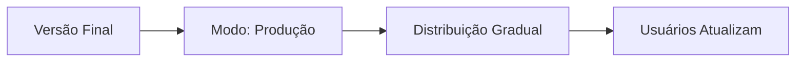

# 🚀 Sistema de Atualizações Inteligente - Guia Rápido

## ✅ **SISTEMA IMPLEMENTADO COM MÚLTIPLOS MODOS!**

Agora o app tem um sistema flexível que se adapta a diferentes situações:

### 🎯 **Modos Disponíveis:**

#### 🏭 **Produção** (Padrão em Release)
- ⏰ Verifica a cada **6 horas**
- 🎯 Ideal para usuários finais
- 🔋 Economiza bateria e dados

#### 🛠️ **Desenvolvimento** (Padrão em Debug)
- ⏰ Verifica a cada **15 minutos**
- 🔄 Ideal para desenvolvimento ativo
- 🧪 Permite testes rápidos

#### 🧪 **Teste**
- ⏰ Verifica a cada **1 minuto**
- ⚡ Para testes intensivos
- 🚀 Resposta quase imediata

#### 🔄 **Sempre Verificar**
- ⏰ Verifica **toda vez que o app abre**
- 🎯 Para situações críticas
- 📱 Máxima agilidade

#### ❌ **Desabilitado**
- 🚫 **Nunca verifica**
- 💾 Para ambientes offline
- 🔧 Controle total

---

## 👨‍💼 **Para Administradores - Como Usar:**

### **🎛️ Acessar Configurações:**
1. Abrir app admin
2. Ir em **"Configurações"**
3. Clicar em **"Gerenciar Atualizações"**
4. Escolher o modo desejado
5. **"Verificar Agora"** para teste imediato

### **📱 Cenários Práticos:**

#### **🔧 Durante Desenvolvimento:**
```
Modo: Desenvolvimento (15 min)
↳ Permite teste rápido das atualizações
```

#### **🧪 Testando Sistema:**
```
Modo: Teste (1 min)
↳ Vê resultado quase imediato
```

#### **🚀 Lançar Nova Versão:**
```
1. Compilar APK → Upload
2. Atualizar Firebase
3. Modo: Sempre Verificar
4. Usuários recebem na próxima abertura!
```

#### **📱 Em Produção:**
```
Modo: Produção (6 horas)
↳ Usuários recebem sem pressa excessiva
```

---

## 🔄 **Métodos de Conveniência:**

### **⚡ Para Desenvolvedores:**
```dart
// Força verificação imediata
await UpdateService.forceCheckNow();

// Ativa modo desenvolvimento 
await UpdateService.enableDevelopmentMode();

// Ativa modo teste
await UpdateService.enableTestingMode();

// Sempre verifica
await UpdateService.enableAlwaysCheck();

// Volta para produção
await UpdateService.enableProductionMode();

// Desabilita verificações
await UpdateService.disableUpdateCheck();

// Status detalhado
String status = await UpdateService.getUpdateStatus();
```

### **📊 Exemplo de Status:**
```
Modo: development
Intervalo: 15 minuto(s)
Última verificação: 3 minuto(s) atrás
Próxima verificação: 12 minuto(s)
```

---

## 🎯 **Fluxo de Trabalho Recomendado:**

### **🛠️ Durante Desenvolvimento:**


### **🧪 Teste Rápido:**


### **🚀 Deploy Produção:**


---

## 💡 **Benefícios:**

### **✅ Flexibilidade Total:**
- 🎯 Cada situação tem seu modo ideal
- 🔄 Mudança rápida entre modos
- 📊 Status transparente

### **✅ Controle Fino:**
- ⏰ Intervalos personalizados
- 🚫 Possibilidade de desabilitar
- ⚡ Verificação forçada quando necessário

### **✅ Experiência Otimizada:**
- 🔋 Não desperdiça recursos
- 📱 Resposta quando necessário
- 🧪 Ideal para testes

---

## 🎉 **Resultado Final:**

**🚀 Agora você tem controle TOTAL sobre quando e como o app verifica atualizações!**

- **Durante desenvolvimento**: Modo desenvolvimento (15 min)
- **Para testes rápidos**: Modo teste (1 min) 
- **Deploy urgente**: Modo sempre verificar
- **Produção estável**: Modo produção (6 horas)
- **Ambiente offline**: Modo desabilitado

**💫 Sistema adaptável para QUALQUER necessidade!**